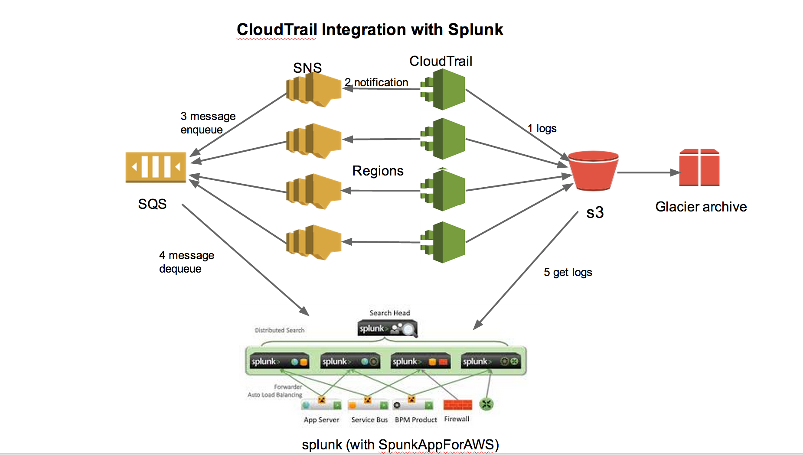

# How to Setup AWS CouldTrail with Splunk

This document describes how to setup AWS Cloudtail services to audit API calls and how to setup SpunkAppForAWS app to generate reports in Splunk.

## What is CloudTrail
[AWS CloudTrail] (http://aws.amazon.com/cloudtrail/) is an AWS service. When enabled, it captures AWS API calls made by or on behalf of an AWS account and delivers log files to an Amazon S3 bucket. 

## Why use CloudTrail
Traditionally system administrators monitor a system's integrity using intrusion detection tools such as Tripwire. System logs are usually sent to 
a central log server for auditing and security analysis.

For services running on AWS, another important operation and security related auditing is to monitor API calls that can change services and environments. 
Use cases enabled by CloudTrail service:

* Security Analysis
* Track Changes to AWS Resources
* Troubleshoot Operational Issues
* Compliance Aid

Here is an example of API call recorded by CloudTrail and how Spunk reports it (what, when, who, where, etc.)

	{ [-]
	   awsRegion: us-west-2
	   eventID: 7ad60379-0e2e-4b6c-8a6f-100f00fc5df1
	   eventName: ModifyReservedInstances
	   eventSource: ec2.amazonaws.com
	   eventTime: 2014-07-14T19:29:42Z
	   eventVersion: 1.01
	   requestID: 900f0797-0f2d-43dd-bcf5-41e1cfbc5c9f
	   requestParameters: { [-]
	     clientToken: fa8494bb-8546-4fc4-9bb8-8dc84e7d0015
	     reservedInstancesSet: { [+]
	     }
	     targetConfigurationSet: { [+]
	     }
	   }
	   responseElements: { [-]
	     reservedInstancesModificationId: rimod-f0713af8-0984-42ff-8016-3dfea813b209
	   }
	   sourceIPAddress: 171.66.221.130
	   userAgent: console.ec2.amazonaws.com
	   userIdentity: { [-]
	     accessKeyId: XXXXXXXXXXXXXXXXXXX
	     accountId: XXXXXXXXXXXXX
	     arn: arn:aws:sts::XXXXXXXXXXX:assumed-role/admin-saml/john
	     principalId: XXXXXXXXXXXXX:jonh
	     sessionContext: { [+]
	     }
	     type: AssumedRole
	   }
	}

## Visualized reporting tools
Many tools are available to generate visualized reports using the CloudTrail files stored in S3 bucket. Here are listed 
[AWS partners](http://aws.amazon.com/cloudtrail/partners/). This documentation describes how to use [SplunkAppforAWS](http://apps.splunk.com/app/1274/) to consume Cloudtrail data and generate reports. 

## The CloudTrail and Spunk integration

In this integration, we create CloudTrail service for each region and Simple Notification Service (SNS) topic for each CloudTrail service. The reports from all regions are aggregated to one S3 bucket. One Simple Queue Service (SQS) is subscribed to all the SNS topics. 



## Prerequisites for this setup

All the setups can be done through AWS console, but we use a script for CloudTrail setup to make sure we have naming schema consistency cross
all regions. All AWS services (Cloudtrail, SNS, SQS) created will have a prefix __'accountname-'__

* Install AWSCLI 

    [AWSCLI] (https://github.com/aws/aws-cli) command line tool is used to create Cloudtrail. To install (or upgrade) the package:

```
$ brew install awscli
```

    This will install _aws_ command under /usr/local/bin. There are three ways to setup AWS CLI AWS credentials. The examples here assumes you run the Cloudtrail creation code on an on-premise system and use a configuration file for key id and key secret. If you run it on EC2, you need to create an IAM role and åthe aws cli can use role-based token automatically.
    
   To configure AWSCLI:
    
```
$ aws --profile <profile> configure
```

   The above command will generate two files, for example:
   
```
$ cat /etc/.aws/awscli.conf
# For AWS CLI
[profile mylab-cloudtrail]
region = us-west-2
...

$cat /etc/.aws/credentials
[mylab-cloudtrail]
aws_access_key_id = <key id>
aws_secret_access_key = <secrect>
```
			

* Create a S3 bucket for CloudTrail report

    We will aggregate CloudTrail reports from different regions into one S3 bucket. A bucket name used in this example is:
_accountname-__cloudtrail.myfqdn_. 

  Follow the instructions here (http://docs.aws.amazon.com/awscloudtrail/latest/userguide/create_trail_using_the_console.html), but skip the optional steps. We will setup SNS using [create-cloudtrail](./scripts/create-cloudtrail.sh). CloudTrail console service will generate a S3 bucket with proper access policies.  

* Create an IAM user

    You should create an IAM user with the minimum access privileges needed. 

   Fexample, you can create an IAM user _cloudtrail-splunkapp_  which has permission to read SQS, delete message from SQS, and get data from S3 bucket. The following polices should work if you use canned AWS policy generator:

* Readonly access to S3 bucket
* Readonly access to CloudTrail
* Full access to the SQS (it deletes messages after read stuff from the message queue)

## Create AWS CloudTrail

For security auditing, you should monitor all regions that CloudTrail service is available. These are the current supported regions:

* us-east-1
* us-west-1
* us-west-2
* eu-west-1
* sa-east-1
* ap-northeast-1
* ap-southeast-1	
* ap-southeast-2

To enable CloudTrail on these regions, download and run [create-cloudtrail](./scripts/create-cloudtrail.sh)

The script calls AWSCLI cloudtrail command to:

* Enable Cloudtrail service in each region to send reports to a __accountname-__cloudtrail.__mfqdn__ S3 bucket
* Create Simple Notification Service (SNS) topic for the Cloudtrail service in each region
* Create  __accountname__-cloudtrail SQS in one region to receive CloudTrail report notification

The script has a dryrun (-n) option to generate the commands so you can see actual commands without running it. 

We consolidate all CloudTrails reports into one S3 bucket that you give at the command line. The script takes care of creating necessary access policies. Global events - generated by services that don't have a regional endpoint, e.g. Identity and Access Management (IAM) - will be logged in one region that you define at the command line. 

## Subscribe Simple Queue Service (SQS) to CloudTrail SNS topics

The SQS named _accountname-cloudtrail_ is creased by create-cloudtrail script. It is easiest to use AWS's SQS service console to subscribe the queue to each SNS cloudtrail SNS topics because AWS service will generate proper policy for the queue to allow messages from the SNS topics.

SQS is needed in Splunk AWS app configuration. Splunk AWS app runs at defined interval to retrieve messages from AWS SQS service. The message body contains the S3 bucket location for Cloudtrail reports. Splunk then calls S3 API to get Cloudtrail reports from the S3 bucket.

## Setup SplunkAppForAWS

The application has two major report categories - Cloudtrail monitoring for API activities, and Billing and Usage that helps budgeting and cost analysis. 

### Billing and usage module

This module requires to turn on [Detailed Billing Reports](http://docs.aws.amazon.com/awsaccountbilling/latest/aboutv2/detailed-billing-reports.html). AWS will publish detailed billing reports in CSV format to the S3 bucket that you specify. If you have consolidated billing setup, ask the payer to create an IAM user that has read access to the S3 bucket that collects billing csv files. If you want to monitor the subaccounts's running status (e.g. the break downs of running on-demand instances, reserved instances, type of instances etc.), you need to create an IAM user in each sub-account that has access to check EC2 status in that subaccount. 

To make the Billing and Usage work, you need the following:

1. If you use consolidated billing, ask the payer to create an IAM user that have read only access to the S3 bucket's billing CSV file
2. If you need to pull dynamic EC2 information, create an IAM user for each account/subaccount with the following policies:
*  Amazon EC2 Reports Access
*  Amazon EC2 Read Only Access
3. opt/splunk/etc/apps/SplunkAppforAWS/lookupsinstancetype.csv
   This file should contain all instances types that you use in your account. The list from the SplinkAppforAWS may not be complete.
4.  aws.conf file 

  The file contains the setup for Billing and Usage. Here an example:

        # more /opt/splunk/etc/apps/SplunkAppforAWS/local/aws.conf

        # All this three stanzas are required, in order to run AWS App.

		[keys]

		# Format :
		# <accountno> = <id> <access-key> <secret> <limit>
		#
		# Where:
		#   id = company/group name without space
		#   access-key = AWS Access Key
		#   secret     = AWS Secret Key 
		#   limit      = Monthly spending limit for this account

        # If you have this
		012345678901 = <rollup-paying account> <IAM billing policy user key> <IAM billing policy key secrete> 200000

        # Accounts/subaccounts. Information can be found in the detailed billing reports
		<account-no1> = <account-name1> <IAM EC2 policy user key> <IAM EC2 policy key secrect> 100000 
		<account-no2> = <account-name2> '' '' 100000

		[regions]

		rgn1 = eu-west-1
		rgn2 = sa-east-1
		rgn3 = us-east-1
		rgn4 = ap-northeast-1
		rgn5 = us-west-2
		rgn6 = us-west-1
		rgn7 = ap-southeast-1
		rgn8 = ap-southeast-2

		[misc]

		# Format :
		# corpkey = <id> <access-key> <secret>
		#
		# Where:
		#   id = company name/corp account name without space
		#   access-key = AWS Access Key
		#   secret     = AWS Secret Key

        # Same as you specified in [key] section
		corpkey = <rollup-paying account name> <IAM billoing user key> <IAM billing user key secret>

		# acno is corp account number for AWS, same as in [key] section
		acno = 01234567891

		# s3bucket is bucket name where AWS bill csv files will be dropped
		s3bucket =  <builling bucket>  
		
5 .  /opt/splunk/etc/apps/SplunkAppforAWS/lookups

   This file contains account and name mapping. Put accounts/subaccounts found in the billing CSV file here:

            # more  accountNames.csv
			accountId,accountName
			012345678901,<name>
			123456789012,<name>
			.....

### CloudTrail module

The SplunkAppForAWS needs to be installed on Splunk search head and indexers. The data input only needs to be configured on indexers where the app will retrieve audit reports and build the indexes. Splunk search head does search against the logindex servers. 

You can setup data input on Splunk Settings->Data Input console:

* Go to "Settings->Data Inputs" 
* Create a new data input
* Fill out the CloudTrail IAM user's key, secret, SQS name, and the region, created by create-cloudtrail.sh script.
* Set script interval to 300 seconds. Cloudtrail delivers report within 15 minutes of API calls to S3 bucket, and within 5 minutes to SNS after the report is posted. You have up to 20 minutes to see the the latest API calls to show up in Splunk.
* In the "Script iterations" box, use a very large number, otherwise, the app script will stop running after 2048 runs.
* Click "More Advanced Setting", check Source Type to Manual, and "Source" to aws-cloudtrail

It will generate a __inputs.conf__ file, that can be managed by a configuration tool such as Puppet. Here is an input.conf file example:

    splunkidexer:/opt/splunk/etc/apps/launcher/local# more inputs.conf 
    exclude_describe_events = 0
	index = aws-cloudtrail
	interval = 30
	remove_files_when_done = 0
	key_id = <access key>
	secret_key = s<access key secret>
	sqs_queue = accountname-cloudtrail
	sqs_queue_region = us-west-2
	sourcetype = aws-cloudtrail
	script_iterations = 1000000
	
### Troubleshooting

* First update to the latest boto library. The package comes with it boto installation under /opt/splunk/etc/apps/SplunkAppforAWS/bin directory. To update:

        mkdir /tmp/boto
        pip install --install-option="--prefix=/tmp/boto"  boto
        cd /tmp/boto/lib/python2.7/site-packages
        tar cvf /tmp/botolib.tar boto

        cd /opt/splunk/etc/apps/SplunkAppforAWS/bin
        mv boto boto.old && tar xvf /tmp/botolib.tar  
        
* /var/log/splunk/splunkd.log file contain splunk logs. Grep 'AWS' keywords to find out if the scripts are running and if there are any problems.

* $SPLUNK_HOME/etc/apps/SplunkAppforAWS/lookups directory should contain billing data pulled from S3 bucket. subaccounts.* files are generated from the get_bill.py program each time a pulling occurs. 

* $SPLUNK_HOME/etc/apps/SplunkAppforAWS/log contains logs generated by various scripts that pulls billing, instance usage information. You need access key and key secret (create an IAM user for it) for the accounts you want to pull the information. 


 
